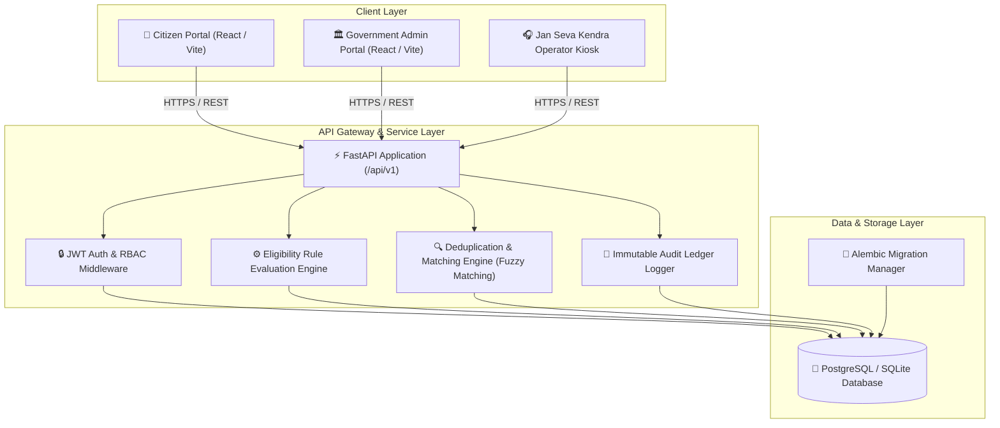
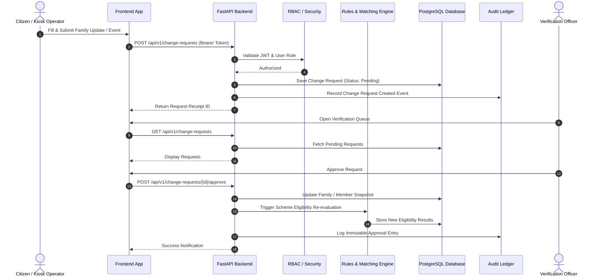
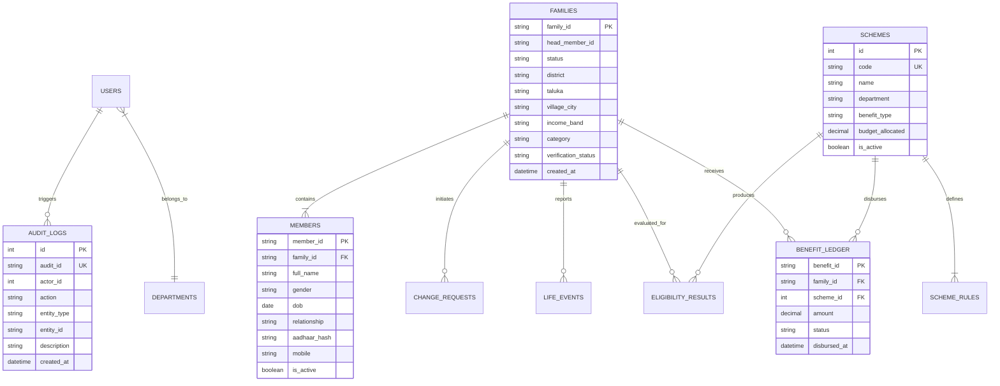

# 🛡️ Pravi ID — Gujarat Family Identity & Beneficiary Management Platform

> **A Unified State-Level Household Identity, Scheme Eligibility Engine & Inter-Department Governance Platform.**

[](https://fastapi.tiangolo.com/)
[](https://react.dev/)
[](https://www.typescriptlang.org/)
[](https://tailwindcss.com/)
[](https://www.postgresql.org/)
[](https://www.docker.com/)

---

## 📌 Executive Summary

**Pravi ID** is a Next-Generation State-Level Household Identity and Social Welfare Governance Infrastructure designed for Gujarat State. It solves the critical challenges of **duplicate beneficiary leakage**, **fragmented department siloes**, and **manual scheme enrollment overhead** by establishing a single source of truth for family units while enforcing strict data privacy and access governance.

### Key Value Pillars
1. **Unified Family 360 Record**: Single state-wide family ID (`GJ-FAM-YYYY-XXXXXXXX`) establishing relationships, demographics, and household status.
2. **Automated Scheme Eligibility Engine**: Real-time evaluation of rules (income bands, age, category, district) matching eligible families to government welfare programs.
3. **De-duplication & Identity Matching**: Fuzzy logic matching engine (Jellyfish + RapidFuzz) detecting potential duplicate citizen profiles before benefit disbursement.
4. **Data Minimization & Inter-Department Privacy**: Attribute-level scope restriction so departments (Education, Food, Health) only access fields permitted by state policy.
5. **Tamper-Evident Immutable Audit Ledger**: Every view, update, login, and scheme approval is logged for auditability and compliance.

---

## 🏗️ System Architecture



---

## 🔄 Core Data Flow Diagram



---

## 🗄️ Database Schema ERD



---

## 👥 Role-Based Access Control (RBAC) Matrix

| User Role | Credentials (Demo Password: `demo123`) | Primary Function | Access Permissions |
| :--- | :--- | :--- | :--- |
| **Citizen** | `citizen` | Household self-service | View own family, check eligible schemes, submit change requests, report life events. |
| **Verification Officer** | `verifier` | Field verification officer | Review pending change requests, resolve duplicate identity matches, approve family updates. |
| **Scheme Officer** | `scheme_officer` | Welfare program manager | Configure scheme rules, trigger state eligibility engine, track scheme disbursements. |
| **Department Officer** | `dept_officer` | Department data consumer | View scope-restricted family data filtered according to department privacy policy. |
| **State Administrator** | `admin` | Executive supervisor | Full platform oversight, state analytics, access control logs, immutable audit ledger. |
| **Assisted Operator** | `operator` | Service kiosk assistant | Help non-tech-savvy citizens submit filings and requests at local Jan Seva Kendras. |

---

## 🛡️ Security & Privacy Architecture

- **Attribute-Level Data Minimization**: Departments (Food, Health, Education) only receive fields authorized for their legal mandate. Unapproved fields (e.g. bank accounts, raw Aadhaar numbers) are redacted at the backend layer.
- **Password Security**: Passwords are hashed using `bcrypt` with `passlib`.
- **Stateless Authentication**: Signed JSON Web Tokens (JWT) with configurable expiration (`ACCESS_TOKEN_EXPIRE_MINUTES=480`).
- **Cryptographic Hashing**: Aadhaar numbers are hashed using SHA-256 (`aadhaar_hash`) to avoid storing plain-text identity numbers.
- **Audit Compliance**: High-level actions trigger an entry in `audit_logs` capturing actor, action, timestamp, IP address, and entity context.

---

## 🛠️ Technology Stack

### Backend
- **Framework**: [FastAPI](https://fastapi.tiangolo.com/) (Python 3.11+)
- **ORM & DB**: [SQLAlchemy v2](https://www.sqlalchemy.org/) with PostgreSQL / SQLite support
- **Migrations**: [Alembic](https://alembic.sqlalchemy.org/)
- **Fuzzy Matching**: `jellyfish` & `rapidfuzz` for identity de-duplication
- **Security**: `python-jose` (JWT) & `passlib[bcrypt]`

### Frontend
- **Framework**: [React 19](https://react.dev/) + [Vite](https://vitejs.dev/)
- **Language**: [TypeScript](https://www.typescriptlang.org/)
- **Styling**: [Tailwind CSS v4](https://tailwindcss.com/)
- **State & Data Fetching**: [@tanstack/react-query v5](https://tanstack.com/query)
- **Icons & UI**: [Lucide React](https://lucide.dev/) & [Recharts](https://recharts.org/)

---

## ⚡ Quickstart Guide

### Prerequisites
- **Node.js** (v18+) & **npm**
- **Python** (3.10+)
- **Docker & Docker Compose** *(Optional for containerized run)*

---

### Option A: Running with Docker Compose (Recommended)

One-command setup starting PostgreSQL database, FastAPI backend, and Vite frontend:

```bash
# Clone the repository
git clone https://github.com/PRANAVMANDANI/pravi.git
cd pravi

# Start all services
docker compose up --build
```

Access the applications:
- 🌐 **Frontend Application**: `http://localhost:3000`
- 📚 **Interactive Swagger API Docs**: `http://localhost:8000/api/docs`
- 🩺 **Backend Healthcheck**: `http://localhost:8000/health`

---

### Option B: Running Locally (Manual Development)

#### 1. Backend Setup (FastAPI)

```bash
# Navigate to backend folder
cd backend

# Create & activate virtual environment
python -m venv .venv

# On Windows PowerShell:
.\.venv\Scripts\Activate.ps1
# On Linux/macOS:
# source .venv/bin/activate

# Install python dependencies
pip install -r requirements.txt

# Run migrations & seed synthetic demo database
alembic upgrade head
python -m app.seed

# Start FastAPI Uvicorn development server
uvicorn app.main:app --reload --port 8000
```

#### 2. Frontend Setup (React + Vite)

```bash
# Open a new terminal and navigate to frontend folder
cd frontend

# Install Node modules
npm install

# Start Vite development server
npm run dev
```

Open **`http://localhost:3000`** in your web browser.

---

## 📡 Key REST API Routes Overview

| Method | Endpoint | Description | Auth Required |
| :--- | :--- | :--- | :--- |
| `POST` | `/api/v1/auth/login` | Authenticate user & issue JWT token | No |
| `GET` | `/api/v1/auth/me` | Fetch active logged-in user profile | Yes |
| `GET` | `/api/v1/families` | List families with district/status filtering | Yes (Govt Roles) |
| `GET` | `/api/v1/families/{id}/360` | Comprehensive Family 360-degree profile | Yes (Govt Roles) |
| `POST` | `/api/v1/change-requests` | Submit household data change request | Yes |
| `POST` | `/api/v1/change-requests/{id}/approve` | Approve change request & update records | Yes (Verifier) |
| `GET` | `/api/v1/schemes` | List government welfare schemes & rules | Yes |
| `GET` | `/api/v1/eligibility/{family_id}` | Retrieve scheme eligibility for a family | Yes |
| `POST` | `/api/v1/identity/match` | Run deduplication fuzzy match check | Yes (Govt Roles) |
| `GET` | `/api/v1/audit` | Query immutable system audit log ledger | Yes (Admin) |
| `GET` | `/api/v1/analytics` | State-level household statistics & metrics | Yes (Admin) |

---

## 📜 License & Demo Disclaimer

This project is created as a **Prototype / Hackathon Demo**. All household data, Aadhaar hashes, and member names are completely **SYNTHETIC** and generated for demonstration purposes. This application is not connected to live government production networks.

---
*Built with ❤️ for Gujarat Social Infrastructure & Digital Governance.*
